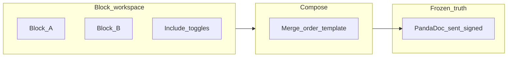

# Document pipeline: blocks, compose, and PandaDoc (team reference)

Internal direction (2026). Complements [ai-product-principles.md](./ai-product-principles.md) and [document-rules-architecture.md](./document-rules-architecture.md). Implementation details (APIs, migrations) are follow-up work.

## North star

Move from **mostly one-shot AI generation** of a full document toward:

1. **Block-based, HITL-gated content** — thematic units with guardrails; humans approve what ships.
2. An explicit **compose** step that **materializes** approved blocks into a formatted artefact.
3. **Frozen copies** for signing and audit held in **PandaDoc** (or equivalent), with this app storing **workflow state and external references**, not relying on a single mutable in-app PDF as the only record.

AI remains **backend / staff-facing** per [ai-product-principles.md](./ai-product-principles.md); client-facing artefacts flow through approved compose and external signing where applicable.

## Scope of Work as the reference example

Today:

- Staff capture lives in structured **`SowCapture`** fields on job assessment data (`objective`, `scope_work`, `methodology`, etc.). See [`src/lib/sowCapture.ts`](../src/lib/sowCapture.ts).
- Non-empty capture is injected into build context as **“SCOPE OF WORK — STAFF CAPTURE”** so generated text must **align and not contradict** staff — see [`src/lib/documentGenerationDrivers.ts`](../src/lib/documentGenerationDrivers.ts).
- Initial SOW JSON is produced by **`POST /api/build-document`** with a per-type schema in [`src/app/api/build-document/route.ts`](../src/app/api/build-document/route.ts) (e.g. `executive_summary`, `scope`, `methodology`, …).
- Job Home surfaces **Data capture** vs **Generate documents** in [`src/components/tabs/DocumentsTab.tsx`](../src/components/tabs/DocumentsTab.tsx).

**Target direction:** treat each theme as a **block** with its own lifecycle: optional AI assist, **guardrails**, and **human approval**. The **composed** SOW is the **output** of a compose step that respects which blocks are included — not only a single monolithic model call that invents every section at once.

## Two checkbox levels (conceptual)

| Level | Intent |
|--------|--------|
| **Per block** | “**Add this block to the composed document**” — include/exclude this thematic unit from the **next** compose. Lets the same job file **grow or shrink** over time without losing block-level history. |
| **Doc level** | “**Combine these documents together**” — include multiple composed artefacts (or internal doc types) in **one deliverable**. Exact behaviour is a product decision: merged PDF, bundled signing flow, multi-document PandaDoc envelope, etc. |

These are **UX/product concepts**; storage and APIs are not fixed in this doc.

## Compose vs block workspace

- **Block workspace** — ongoing editing, approval, and toggles; source of truth for **what could** ship.
- **Compose** — **separate function**: reads current **included** blocks + ordering rules + template/boilerplate, produces a **versioned output** suitable for preview and handoff to signing.

Re-composing after changes creates a **new** logical version; **frozen** legal/signing copies should not be silently overwritten (see PandaDoc below).

## PandaDoc and frozen copies

**PandaDoc (API)** is the intended place for **immutable, sent, and signed** documents. This application should:

- Own **workflow**: block state, compose triggers, job linkage.
- Store **references** (e.g. PandaDoc document or envelope IDs, status, timestamps).
- Treat PandaDoc as **system of record** for what the client actually received and signed, once sent.

Webhook handling, OAuth, template mapping, and database columns are **out of scope** for this spec; implement in dedicated tickets.

## Relationship to current implementation (anchors)

| Area | Role today |
|------|------------|
| [`src/app/api/build-document/route.ts`](../src/app/api/build-document/route.ts) | Primary **full-document** generation from job + photos + rules + staff constraints. |
| [`src/lib/sowCapture.ts`](../src/lib/sowCapture.ts) | Staff **block** text for SOW alignment. |
| [`src/lib/documentRules.ts`](../src/lib/documentRules.ts) + [document-rules-architecture.md](./document-rules-architecture.md) | Words and style layers for Claude. |
| [`src/app/jobs/[id]/docs/[type]/page.tsx`](../src/app/jobs/[id]/docs/[type]/page.tsx) | Per-type editor, chat, preview, save. |

The pipeline described here **layers on top** of these pieces: it does not replace them overnight; it clarifies **where HITL and freezing** should live conceptually.

## Out of scope (this document)

- PandaDoc API contract, authentication, webhooks, and error handling.
- Database schema for block flags, compose runs, or external IDs.
- Per-doc-type rollout order (SOW first vs global).

## Related

- [ai-product-principles.md](./ai-product-principles.md) — HITL, client-facing stance.
- [document-rules-architecture.md](./document-rules-architecture.md) — rules vs layout vs `build-document`.
